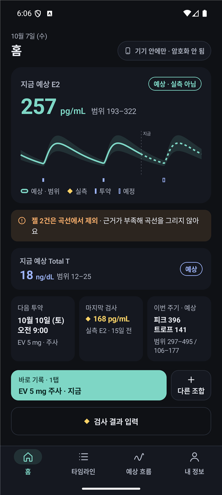
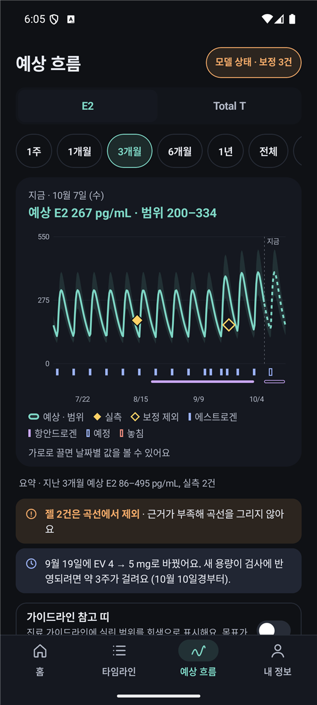
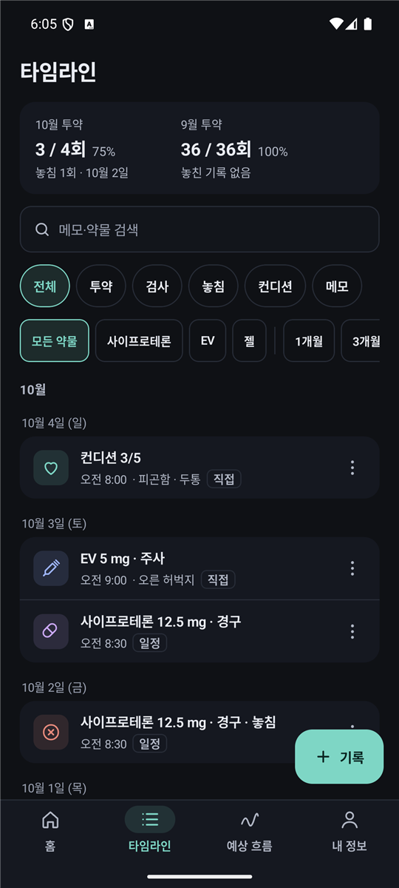
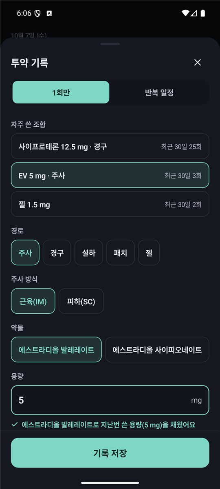
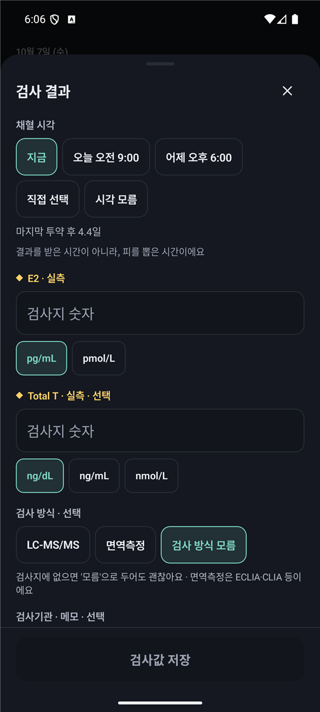
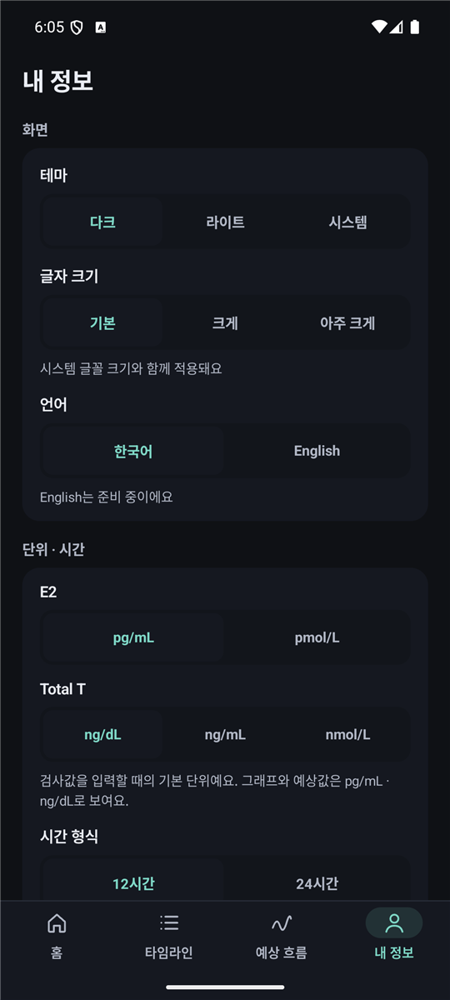

# HormoneLog

*[한국어](README.md) · English*

> An offline Android app for logging hormone replacement therapy (HRT) · local-only · no server · no account

## What it is

On HRT you dose every day or every week, but you get a blood test maybe once every few
months. So **between tests there is no way to know where your levels actually are** —
whether you are just past a peak or scraping the trough before the next injection.

HormoneLog fills that gap. Log your doses and it draws a **projected curve** from
pharmacokinetic models in the published literature; log a real lab value and it
**calibrates that curve to your own body**. The more lab values you add, the more
personalised the curve becomes.

- **Everything stays on the device** — no uploads, no account, no network calls
- **Only draws what it can source** — a route gets a curve only when every parameter has provenance; the rest (gel) is left off the curve, and the app says why
- **Never blends estimates with measurements** — an estimate is a teal band, a measurement a yellow diamond, always

**⚠️ Reference tool only.** The projected curves are *population approximations* derived
from public literature, not clinically validated values. The app does not suggest
diagnoses, prescriptions, or dose changes, and every piece of data stays on the
device (no network calls).

## Screens

|  |  |  |
| :---: | :---: | :---: |
| **Home** — current E2 / Total T estimate, next dose, last lab, one-tap logging | **Flow** — past (solid) / future (dashed), range band, measured diamonds, missed doses | **Timeline** — records by date, daily medicines folded by month, filters and search |

|  |  |  |
| :---: | :---: | :---: |
| **Log a dose** — one tap for a frequent combination, single dose or repeating schedule, injection site | **Log a lab result** — measured E2 / Total T, unit conversion, draw time | **Me** — display, units, body info, schedules, reminders, notes, report, backup |

## Features

- **First run** — six steps (current medication and schedule, back-filling past doses, testes, lab units, pre-HRT labs). Every step but the first can be skipped
- **Dose logging** — drug, route (IM / SC injection, oral, sublingual, patch, gel), amount, time, injection site, status (taken / late / missed). A patch is logged by strength (µg/day) and change cycle
- **Repeating schedules** — weekdays, time of day, end date. A second schedule for the same drug and route asks first, then ends the old one and starts the new one. The past doses a schedule would have produced are counted and shown before anything is recorded
- **Lab results** — measured E2 / Total T, unit conversion (pg/mL·pmol/L, ng/dL·ng/mL·nmol/L), assay method, draw time (unknown allowed). A value far from the expectation is flagged as a possible unit mix-up before saving. The result screen shows the difference from the estimate, where the draw falls in the dosing cycle, and whether (and if not, why not) it calibrated the curve
- **Projected flow** — E2 and Total T curves from literature PK/PD parameters
  - E2: per-ester 3-compartment models (estrannaise.js), oral / sublingual one-compartment models, patch
  - Total T: E2 delayed effect compartment + Hill suppression + saturable cyproterone suppression. Using your testes status sharpens it; "prefer not to say" draws no curve
  - **Per-route calibration from real labs** — injection, oral/sublingual and patch are calibrated separately, the correction is limited to −50%…+100%, and the range narrows as labs accumulate
  - A **model status** screen (labs used and not used, with reasons) and an **evidence explorer** (parameters, sources, limits)
- **Timeline** — grouped by date, daily medicines folded by month, filters by type / drug / period plus search, edit · duplicate · delete per row
- **Reminders** — injection days (the evening before and on the day), daily medicines (once more 30 minutes later), lab interval, appointments. **투약 완료** (mark as taken) in the notification records the dose without opening the app, and a locked screen shows only a neutral line
- **Other records** — condition and symptoms, weight and blood pressure, stock (counts down as you log doses, with a run-out estimate), extra labs (LH, FSH …)
- **Visit notes** — visit memos, next appointment, clinic info (typed by the user; no bundled data, no network)
- **Report** — an A4 PDF or a tall image for a clinic visit. No name and no app name in it, and you pick the app to share with
- **Home-screen widget** — next dose and a mark-as-taken button; it never shows a lab value
- **Backup & restore** — an `.hlb` file (saved without a password) holds everything; restoring shows what is inside first and keeps the current state aside. CSV export / import reports which rows were skipped and why ([sample](docs/sample/hrt_2month_sample.csv))
- **Privacy** — records live only in a file on the device; cloud backup and device-to-device transfer are off. You can hide the app in the recents switcher, disguise the launcher name and icon ("메모"), and neutralise notification wording (the app's real name still shows in the phone's app list and in notification headers). There is no app lock and no encryption of the records
- **Display** — dark, light or system theme, text size (default · large · largest), 12/24-hour clock
- English is not supported yet (the strings have to be moved out of the code first)

## Architecture

Multi-module Gradle:

| Module | Role |
| --- | --- |
| `app` | Jetpack Compose UI, one `AppState` + pure reducers (`RecordsReducer`, `ScheduleOps`, `MemoOps` …) + `AppViewModel`; reminders, widget and file handling |
| `core:domain` | Domain types (`DoseEvent`, `LabResult`, `Regimen`, `VisitMemo` …), unit normalization |
| `core:evidence` | Evidence bundle — a route model activates only when every parameter has provenance |
| `core:model-engine` | E2 curve engine, TT suppression engine, measured-value calibration engine, cycle analysis |
| `core:data` | Local JSON file persistence (`org.json`), backup files, CSV I/O |

- All state transitions are pure functions (the clock is passed in); only transitions that need persistence are written to file by the `ViewModel`. Writes happen off the main thread, one at a time, and a failed write is shown on screen
- A curve is drawn only when the evidence bundle has provenance for its parameters — gel evidence is thin, so it is kept off the curve and only recorded
- Records this build cannot read (written by a newer build, or holding a date or number no real log could hold) are not loaded and not deleted: they are kept and written back. "Delete all records" removes them too
- Model parameters, sources, and review notes: [docs/evidence/README.md](docs/evidence/README.md)

Design docs: [spec](docs/superpowers/specs/2026-08-26-hormone-log-android-design.md) · [implementation plan](docs/superpowers/plans/2026-08-26-hormone-log-android.md) · [design request](docs/DesignRequest_2026-10-04.md) · [redesign log](docs/RedesignStatus_2026-10-04.md)

## Build & run

```bash
./gradlew :app:assembleDebug
./gradlew :app:installDebug         # install on a connected device
./gradlew testDebugUnitTest         # unit tests, all modules
```

The screen tests (`app/src/androidTest`) wipe the app's records and settings before they
start, so run them **only on a dedicated emulator**. With several devices attached, pick
the emulator with `ANDROID_SERIAL`:

```bash
ANDROID_SERIAL=emulator-5554 ./gradlew :app:connectedDebugAndroidTest
```

A local Android SDK is required (`sdk.dir` in `local.properties`).

### Release build

```bash
./gradlew :app:assembleRelease
adb install -r app/build/outputs/apk/release/app-release.apk
```

With no keystore, the build signs with the debug key and produces a sideloadable
APK. To sign with your own key, see [docs/RELEASE.md](docs/RELEASE.md). Distributed
builds live in [Releases](../../releases).

## Tech stack

- Kotlin 2.3.21 · Jetpack Compose (BOM 2026.06.00) · AGP 9.1.1 · Gradle 9.3.1 · JDK 17
- minSdk 28 · targetSdk 36 · compileSdk 36
- dark and light themes; navigation is a state enum + stack (no navigation-compose)
- persistence is plain JSON files; no Room

## How it was made

This project was **built with Anthropic Claude** — design, implementation, literature
research, model parameter calibration, unit tests, on-device verification (Galaxy S23),
and release were all done in conversational sessions with the coding agent **Claude Code**
(model **Claude Sonnet 5**). Commits are tagged `Co-Authored-By: Claude Sonnet 5`.

## Status

Currently **in real-world testing**. In October 2026 the screens were rebuilt to match the
design prototype (P0 · P1 · P2). Not done yet: an English UI, and bundling the Pretendard
typeface (the system font is used for now).
