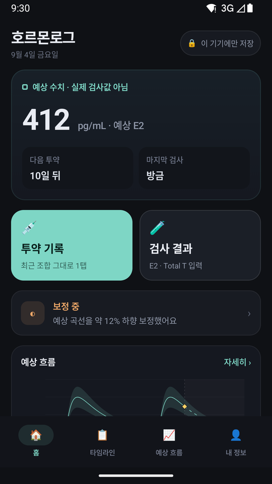
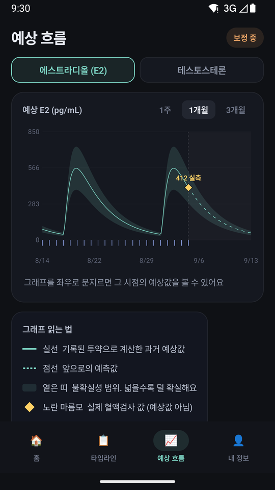
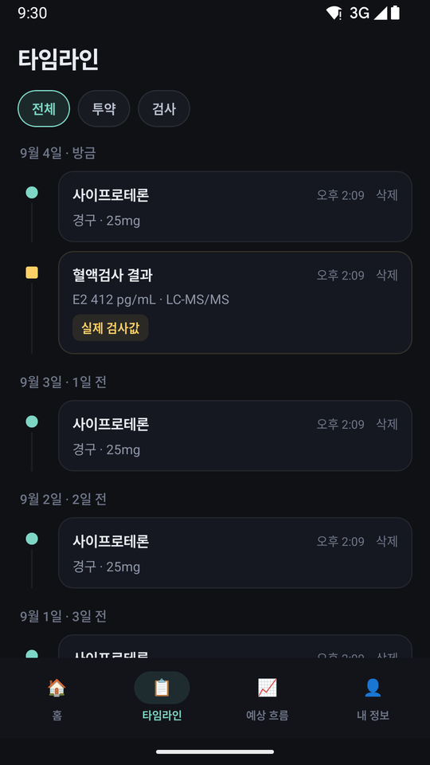
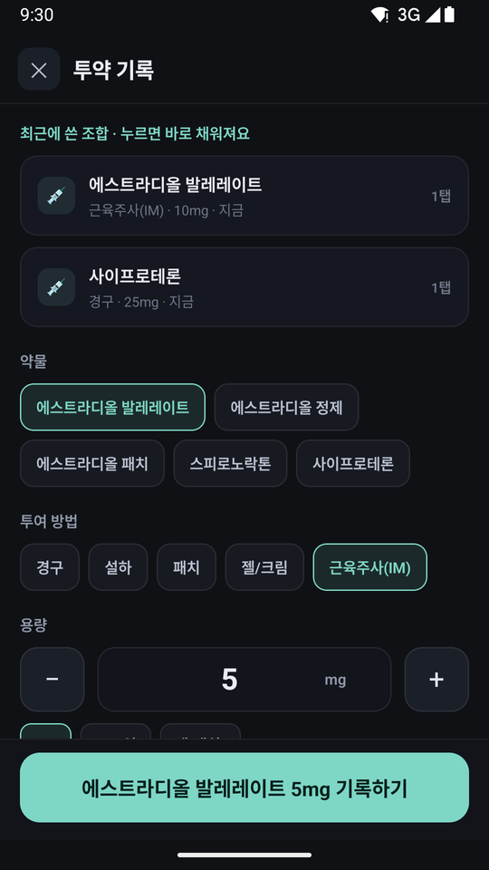
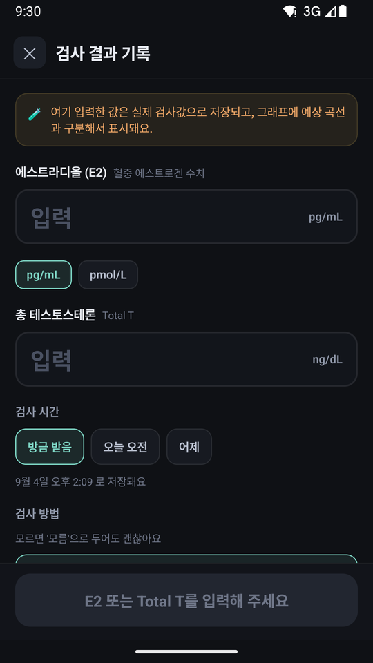
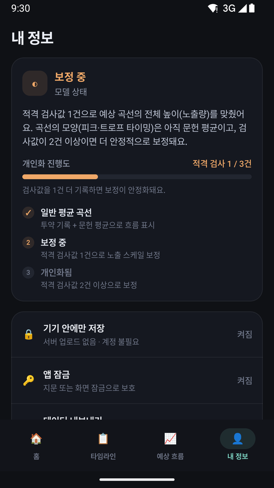

# 호르몬로그 (HormoneLog)

*한국어 · [English](README.en.md)*

> HRT(호르몬 대체요법) 기록 안드로이드 앱 · 로컬 전용 · 서버 없음 · 계정 불필요
> An offline Android app for logging hormone replacement therapy.

## 소개

HRT를 하면 투약은 매일·매주 하는데, 혈액검사는 몇 달에 한 번뿐입니다. 그래서 **검사와 검사 사이에는
내 호르몬 수치가 어디쯤인지 알 방법이 없습니다.** 주사 직후인지, 다음 주사 직전 바닥인지조차 감으로만
짐작하게 됩니다.

호르몬로그는 그 빈칸을 채웁니다. 투약 기록을 넣으면 공개 문헌의 약동학(PK) 모델로 **예상 곡선**을
그리고, 실제 검사값을 넣으면 그 값에 맞춰 곡선을 **내 몸에 맞게 보정**합니다. 검사값이 쌓일수록
곡선이 개인화됩니다.

- **기록은 전부 기기 안에만** — 서버 업로드도, 계정도, 네트워크 호출도 없습니다
- **근거 있는 것만 그림** — 파라미터 출처가 확보된 투여 경로만 곡선을 그리고, 나머지는 `Model unavailable`로 남겨둡니다
- **예상값과 실측값을 섞지 않음** — 그래프에서 항상 구분해 표시합니다

**⚠️ 참고용 도구입니다.** 예상 곡선은 공개 문헌에서 유도한 *인구집단 근사치*이며 임상 검증값이 아닙니다.
앱은 진단·처방·용량 변경을 제안하지 않으며, 모든 데이터는 기기 안에만 저장됩니다(네트워크 호출 없음).

## 화면

|  |  |  |
| :---: | :---: | :---: |
| **홈** — 현재 예상 수치, 다음 투약까지 남은 기간, 보정 상태 | **예상 흐름** — 과거(실선)/미래(점선), 불확실성 밴드, 실측값 마름모 | **타임라인** — 날짜별 기록, 투약·검사 필터 |

|  |  |  |
| :---: | :---: | :---: |
| **투약 기록** — 최근 조합 1탭 입력, 약물·경로·용량 선택 | **검사 결과** — E2 / Total T 실측값, 단위 변환, 검사 방식 | **내 정보** — 개인화 진행도, 로컬 저장·앱 잠금·CSV |

## 기능

- **투약 기록** — 약물·경로·용량·시각(정확한 날짜/시간 선택 포함), 반복 일정(레짐) + 예시 데이터 한 번에 넣기
- **검사 결과** — E2 / Total Testosterone 실측값, 단위 변환(pg/mL·pmol/L, ng/dL·nmol/L), 검사 방식 기록
- **예상 흐름** — 문헌 PK/PD 파라미터 기반 E2·Total-T 예상 곡선
  - E2: estradiol ester별 3-compartment 모델(estrannaise.js), 경구·설하 Bateman 모델
  - Total-T: E2 지연 효과구획 + Hill 억제 + CPA 포화 억제
  - 과거(실선) / 미래(점선) 분할, 불확실성 밴드, 투약 눈금, 실측값 마름모
  - **실측 검사값으로 곡선 보정** — 측정/예측 비율의 기하평균으로 노출 스케일 조정(Level 1–2, clamp [0.5, 2.0])
- **타임라인** — 날짜별 그룹, 투약/검사 필터, 항목별 삭제
- **기록 삭제** — 개별 / 종류별 일괄 / 전체 초기화 / 반복 일정, 모두 확인 다이얼로그
- **CSV 불러오기·내보내기** — Storage Access Framework, 권한 불필요 ([샘플](docs/sample/hrt_2month_sample.csv))
- **병원 메모** — 호르몬 처방 병원을 사용자가 직접 기록(번들 데이터·네트워크 없음)

## 아키텍처

멀티모듈 Gradle:

| 모듈 | 역할 |
| --- | --- |
| `app` | Jetpack Compose UI, 단일 `DashboardState` + 순수 `DashboardReducer` + `DashboardViewModel` |
| `core:domain` | 도메인 타입(`DoseEvent`, `LabResult`, `Regimen`, `Clinic` …), 단위 정규화 |
| `core:evidence` | 근거 번들 — 파라미터별 출처(provenance)가 갖춰져야만 경로 모델 활성화 |
| `core:model-engine` | E2 곡선 엔진, TT 억제 엔진, 실측 보정 엔진 |
| `core:data` | 로컬 JSON 파일 영속화(`org.json`), CSV 입출력 |

- 상태 전이는 전부 순수 함수(`DashboardReducer`), 저장이 필요한 전이만 `ViewModel`이 파일에 반영
- 곡선은 근거 번들에 파라미터 출처가 있을 때만 그림 — gel은 근거가 얇아 `Model unavailable` 유지
- 모델 파라미터·출처·검토 기록: [docs/evidence/README.md](docs/evidence/README.md)

설계 문서: [명세](docs/superpowers/specs/2026-08-26-hormone-log-android-design.md) · [구현 계획](docs/superpowers/plans/2026-08-26-hormone-log-android.md)

## 빌드 & 실행

```bash
./gradlew :app:assembleDebug
./gradlew :app:installDebug         # 연결된 기기에 설치
./gradlew testDebugUnitTest         # 전 모듈 단위 테스트
```

로컬에 Android SDK가 필요합니다(`local.properties`의 `sdk.dir`).

### 릴리즈 빌드

```bash
./gradlew :app:assembleRelease
adb install -r app/build/outputs/apk/release/app-release.apk
```

키스토어가 없으면 debug 키로 서명해 사이드로드 가능한 APK를 만듭니다. 본인 키로 서명하는
방법은 [docs/RELEASE.md](docs/RELEASE.md) 참고. 배포판은
[Releases](../../releases)에 있습니다.

## 기술 스택

- Kotlin 2.3.21 · Jetpack Compose (BOM 2026.06.00) · AGP 9.1.1 · Gradle 9.3.1 · JDK 17
- minSdk 28 · targetSdk 36 · compileSdk 36
- 강제 다크 테마, 네비게이션은 상태 enum + `when`(navigation-compose 미사용)
- 영속화는 평문 JSON 파일 (Room/암호화는 후속 과제)

## 만든 방식

이 프로젝트는 **Anthropic Claude로 구축했습니다** — 코딩 에이전트 **Claude Code**(모델 **Claude Sonnet 5**)와의
대화형 세션으로 설계·구현·문헌 조사·모델 파라미터 보정·단위 테스트·실기기(Galaxy S23) 검증·릴리즈까지 진행했습니다.
커밋에는 `Co-Authored-By: Claude Sonnet 5` 가 표기되어 있습니다.

## 상태

현재 **실사용 테스트 중**입니다.
